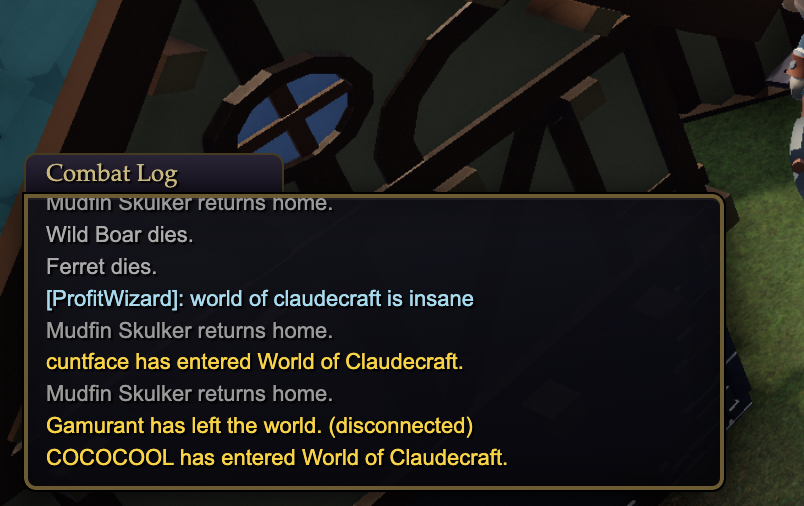

<div align="center">

[](https://www.typescriptlang.org/)
[](https://nodejs.org/)
[](https://threejs.org/)
[](https://vite.dev/)
[](https://vitest.dev/)
[](https://www.postgresql.org/)
[](LICENSE)
[](package.json)
[](https://discord.gg/GjhnUsBtw)

[English](README.md) · [Español](README.es.md) · [Español (España)](README.es_ES.md) · [Français](README.fr_FR.md) · [Français (Canada)](README.fr_CA.md) · [Italiano](README.it_IT.md) · [Deutsch](README.de_DE.md) · [简体中文](README.zh_CN.md) · **繁體中文** · [한국어](README.ko_KR.md) · [日本語](README.ja_JP.md) · [Português (Brasil)](README.pt_BR.md) · [Русский](README.ru_RU.md)

</div>

# World of ClaudeCraft —— 經典風格 MMO

[加入社群 Discord](https://discord.gg/GjhnUsBtw)


一款帶有經典時代 MMO 風味、可自行架設與遊玩的微型 MMO：

1. **線上遊玩**——一款真正的主從架構遊戲，具備帳號、儲存在 Postgres 的持久角色，並能和其他玩家同處於同一個世界。
2. **離線遊玩**——直接在瀏覽器中進入這個世界。

兩者都執行**同一套確定性模擬核心**（`src/sim/`），因此離線世界的行為，與權威多人伺服器為線上所有人執行的內容完全一致。

## Screenshots


| | |
|:---:|:---:|
| <br>*Eastbrook 營火旁的黃昏* | <br>*在 The Hollow Crypt 火炬照明下拉怪打菁英* |
| <br>*殘破禮拜堂中不得安息的亡者* | <br>*在盜賊營地寡不敵眾* |
| <br>*稀有生怪 Old Greyjaw 在北方道路上被追擊獵殺* | <br>*在 Smith Haldren 處整裝——提示框、背包、金幣* |




---

## Host it（一行指令）

```bash
cp .env.example .env
# 編輯 .env，並設定一組長而隨機的 POSTGRES_PASSWORD
docker compose up -d --build     # postgres + 遊戲伺服器，完整建置
# 開啟 http://localhost:8787 —— 帳號、角色、整個世界
```

若要**遠端架設**：把 compose 堆疊部署到任意 VPS，在環境中設定一組真正的 `POSTGRES_PASSWORD`，並以 TLS 反向代理在 8787 連接埠前面把關（用 Caddy 只要兩行——`your.domain { reverse_proxy localhost:8787 }`）；WebSocket 會自動被代理，而用戶端在 https 頁面上會自動選用 `wss://`。驗證端點會依 IP 進行速率限制；密碼採用 scrypt 雜湊；權杖在 7 天後過期。切勿在正式環境中設定 `ALLOW_DEV_COMMANDS=1`（它會啟用測試機器人所用的升級／傳送作弊指令）。

## Develop online（熱重載）

```bash
npm install
cp .env.example .env
# 編輯 .env，把 POSTGRES_PASSWORD 與 DATABASE_URL 設為相同的密碼
npm run db:up        # docker 中的 postgres 16（連接埠 5433，以 volume 持久化）
npm run server       # 在 :8787 上的權威遊戲伺服器（REST + WebSocket）
npm run dev          # 在 :5173 上的用戶端開發伺服器（代理 /api 與 /ws）
```

開啟 http://localhost:5173 →**Play Online**→建立帳號→建立角色→Enter World。再開一個瀏覽器／分頁並再次登入——你會在鎮上看到彼此。`Enter` 開啟聊天。

- **帳號**：scrypt 雜湊密碼、7 天的 bearer 權杖（`auth_tokens`）。
- **角色**：每個帳號最多 10 個；等級／裝備／背包／任務／座標／金錢以 JSONB 持久化在 Postgres——每 30 秒、登出時與伺服器關閉時各儲存一次。名稱全域唯一、僅限字母、經典風格。
- **伺服器具權威性**：用戶端以 20 Hz 串流移動意圖與指令；伺服器執行世界（一個共用的 `Sim`），並送出依興趣範圍裁切的快照（~120 yd）以及依玩家路由的事件。所有戰鬥運算、戰利品擲骰、任務進度與商人交易都在伺服器端發生；用戶端只是個渲染器。
- **隊伍**（最多 5 人）：右鍵點擊某位玩家→*Invite to Party*。隊伍框顯示在左側，成員共享拾取權，並依真正的原版團隊加成（3／4／5 人為 1.166/1.3/1.43）共享擊殺任務進度與分配經驗值。用 `/p message` 進行隊伍聊天。隊友在小地圖上以藍色光點顯示。
- **交易**：右鍵點擊某位玩家→*Trade*。雙方各自擺上物品與金錢，兩人都必須確認，交換為原子操作且由伺服器驗證（任務物品不可交易）。走開即取消。
- **決鬥**：右鍵→*Challenge to a Duel*。3 秒倒數，戰至一方剩 1 點生命為止——無人死亡，勝者會在全區公告。跑到 60 碼外即判棄權。
- **The Ashen Coliseum**（1v1 排名競技場）：按 `G`（或 ⚔ 按鈕）開啟競技場面板並*Enter the Queue*。配對系統會把你和線上評分最接近的對手湊成一對，再把你們兩人傳送進一座私人、火炬照明的鬥技坑。5 秒倒數會為兩名鬥士回復並重置狀態以求公平開局；當一方在 1 點生命時認輸時對戰結束（無人死亡）。勝負會牽動一個持久的 **Elo 評分**（所有人從 1500 起算），而你會回到你排隊時的原處。面板會顯示你的名次、即時的線上天梯，以及歷來排行榜（`GET /api/arena/leaderboard`）。
- **多人規則**：經典拾取權（第一個對怪物造成傷害的玩家擁有其戰利品／經驗值／任務進度——其他人只會看到「You don't have permission to loot that.」）、怪物在其目標死亡時改鎖定下一個攻擊者（不會免費重置）、加入／離開公告，以及 `/say` 風格的聊天。

## The Hollow Crypt —— 5 人菁英副本

Brother Aldric 的故事線延續到 *The Restless Dead* 之後：**Whispers Below**（在殘破禮拜堂找出 Gravecaller 的符印）→**The Binding Rite**（從 kobold 礦坑採集 Blessed Tallow、從不得安息的亡者身上採集 Ghostly Essence）→**Into the Hollow**（*建議玩家數：5*）——在禮拜堂下方地穴的最底層擊殺 Morthen the Gravecaller。

- Fallen Chapel 的地穴門會把你的**隊伍傳送進專屬的私人副本拷貝**（6 個位置；副本在淨空 5 分鐘後重置）。
- 內部：火炬照明的廳堂、成對出現的**菁英**雜怪群（原版菁英縮放：約 2.3× 生命、約 1.5× 傷害、雙倍經驗值）、副王 Sexton Marrow，以及 Morthen——一個 10 級菁英王，每 10 秒施放一次 **Shadow Pulse** 範圍攻擊。副本雜怪在副本重置前不會重生。
- 獎勵：各職業原型對應的稀有（藍色）武器、1 金幣、1500 經驗值。
- 它確實是針對 5 人調校的：我們的自動化 5 機器人團隊（warrior、paladin、priest、mage、hunter，搭配集火與治療 AI）約 5 分鐘清完，約陣亡 10 次（`node scripts/crypt_raid.mjs`，需要 ALLOW_DEV_COMMANDS=1）。

```
docker compose ps          # eastbrook-db（postgres:16-alpine，含健康檢查）
node scripts/mp_integration.mjs   # 26 項檢查的 API/WS/持久化測試組
node scripts/mp_browser.mjs       # 兩個真實瀏覽器用戶端互相看見
```

## The Sunken Bastion & Gravewyrm Sanctum

陰謀並未隨 Morthen 而終結。**The Sunken Bastion**（5 人、約 13 級、Mirefen 東南）關著 Vael the Mistcaller——他會在生命 60% 與 30% 時召喚一波波 Drowned Thralls。最終章是 **Gravewyrm Sanctum**（5 人、20 級、Thornpeak 下方）：三間滿是菁英 boneguard 與 drakonid 的廳室、Korgath the Bound（生命低於 30% 時狂暴）、Grand Necromancer Velkhar（更多增援波次），以及 **Korzul the Gravewyrm**——史詩武器在此掉落，而前置任務鏈可以單人完成，因此沒有人會被擋在故事之外。


## Play offline

```bash
npm run dev        # 開啟 http://localhost:5173 -> Play Offline
```

為你的角色命名、從九個職業中任選其一，你就身處 **Eastbrook Vale**（1-7 級）：一座被六個據點環繞的市集小鎮——北邊的狼群路徑、東邊的野豬草原、西邊的 the Webwood、西北邊的 Mirror Lake、西南邊的 kobold 銅礦坑、東北邊有不得安息亡者的殘破禮拜堂，以及東南邊 Gorrak 的盜賊營地。北方道路穿越一處山隘攀升進入 **Mirefen Marsh**（6-13，據點：Fenbridge），再往上通往 **Thornpeak Heights**（13-20，據點：Highwatch）——三個區域、約 60 個任務，以及一條故事線：Gravecaller 的陰謀，從 Eastbrook 外圍最初那些不得安息的枯骨，一直到山峰下方的 **Korzul the Gravewyrm**。每個據點都有商人（包括販售貨真價實白色裝備的武器匠與防具匠）、一處墓地、各自的音樂，以及一張區域地圖。

### Controls（經典配置）

| Input | Action |
|---|---|
| `W`/`S` | 前進／後退——`A`/`D` 轉向（按住右鍵時改為平移），`Q`/`E` 平移 |
| right-drag / left-drag | 滑鼠視角／環繞鏡頭 &nbsp;·&nbsp; 滾輪縮放 · `Space` 跳躍 |
| `Tab` | 循環選取最近的敵人 · 左鍵選取目標 · 右鍵攻擊／拾取／交談 |
| `1`–`9`、`0`、`-`、`=` | 動作列 |
| `F` | 互動（拾取屍體／撿起物件／交談） |
| `C` `P` `L` `M` `B` `G` | 角色 · 法術書 · 任務日誌 · 世界地圖 · 背包 · 競技場（Ashen Coliseum） |
| `V` / `R` / `Esc` | 名條 · 自動奔跑 · 關閉視窗／清除目標 |

### Classic-fidelity checklist

**公式（真正的原版公式）**
- 怒氣轉換 `c = 0.0091L² + 3.23L + 4.27`；造成傷害時獲得 `7.5·d/c`，承受傷害時獲得 `2.5·d/c`
- 法術命中表，含 +3 等級的斷崖（96/95/94/83%）；近戰未命中／閃躲依等級而定
- 護甲減傷 `armor/(armor + 85·AttackerLevel + 400)`
- 生命／法力屬性規則：前 20 點耐力 → 各 1 點生命，其餘 → 各 10；前 20 點智力 → 各 1 點法力，其餘 → 各 15
- 經驗值曲線 400/900/1400/…… 直到 20 級；怪物經驗值 `45 + 5·L`，並有真正的零差距灰色區間
- 1.5 秒公共冷卻（rogue 為 1.0 秒）、武器揮擊計時、5 秒法力規則

**全部九個原版職業（學習等級與階級數值均取自原版，1–20——法術會隨你升級而提升階級：Lightning Bolt 在 8 級得 R2、14 級得 R3、20 級得 R4，還有 Execute、Kidney Shot、Flash Heal、Stormstrike、Starfire 等新的高等級技能）**
- *Warrior*：怒氣、Heroic Strike（下一次揮擊觸發、不受 GCD 限制）、Battle Shout、Charge、Rend、Thunder Clap、Hamstring、Bloodrage、Overpower（閃躲觸發）
- *Paladin*：Seal of Righteousness（武器附魔）由 **Judgement** 釋放、Holy Light、Devotion Aura、Blessing of Might、Divine Protection（吸收）、Hammer of Justice（昏迷）、Lay on Hands
- *Hunter*：**遠程 Auto Shot**（8–35 yd，含經典死區）、Raptor Strike、Aspect of the Hawk、Serpent Sting、Arcane Shot、Concussive Shot、Mongoose Bite（閃躲觸發）、Wing Clip
- *Rogue*：能量 + **連擊點數**、Sinister Strike、Eviscerate、Backstab（背後 + 匕首）、Gouge、Evasion、Slice and Dice、Sprint
- *Priest*：Smite、Lesser Heal、Power Word: Fortitude、Shadow Word: Pain、**Power Word: Shield**（吸收）、**Renew**（持續治療）、Mind Blast
- *Shaman*：Lightning Bolt、**Rockbiter Weapon**（附魔）、Healing Wave、Earth Shock、**Lightning Shield**（荊棘）、Flame Shock
- *Mage*：Fireball、Frost Armor、Arcane Intellect、Frostbolt、Conjure Water、Fire Blast、Arcane Missiles（引導）、**Polymorph**、Frost Nova
- *Warlock*：Shadow Bolt、Demon Skin、Immolate、Corruption、**Life Tap**、Curse of Agony、**Drain Life**（引導式生命竊取）
- *Druid*：Wrath、Healing Touch、Mark of the Wild、Moonfire、Rejuvenation、Thorns、Entangling Roots、**Bear Form**（10 級可切換的變身）
- 治療法術可以指定隊伍成員為目標（點擊一個隊伍框，再施放治療）；增益可施放於友方玩家；治療可暴擊；吸收護盾會在生命之前先承受傷害。

**世界與系統**
- 進食／飲水：坐下，於 18 秒內回復，受到傷害或站起時中斷——而且沒錯，你可以同時進食與飲水
- 商人：購買食物／飲水、賣掉你的灰色物品；金幣以 g/s/c 顯示
- 帶有閃光的地面任務物件（把盜賊的補給箱偷回來）
- 怪物 AI：遊蕩、依等級差距的近距離仇恨、社交拉怪（murloc 會從更遠處拉怪——帶上朋友吧）、追擊、繫繩—脫戰—重置、屍體拾取、重生；還有一個長計時的稀有生怪（Old Greyjaw）
- 死亡 → 釋放靈魂 → 墓地；墜落傷害；游泳會減速
- 任務日誌含放棄功能、附帶問候語的閒談對話、各職業專屬獎勵

**呈現**
- 一切皆程序化生成：木構造房屋、瓦片屋頂、禮拜堂、市集攤位、帳篷、火光閃爍的營火、礦坑入口、殘破石柱、釣魚碼頭、murloc 泥屋、繪入地形的道路、草叢、松樹 + 橡樹、含動態水面的湖泊、飄移的雲，以及即時陰影
- 十二個綁定骨架的生物族系（wolf/boar/spider/murloc/kobold/skeleton/humanoid/troll/ogre/elemental/dragonkin/sheep），具備行走／攻擊／施法／坐下／死亡動畫
- 為每個法術、物品與增益繪製的程序化圖示——於執行階段在 canvas 上繪製，沒有素材檔案
- 經典 UI：肖像單位框、含持續時間的增益／減益條、含冷卻掃描 + 範圍／資源著色的動作列、施法／引導條、法術書、角色裝備檢視、任務日誌、世界地圖、商人 + 戰利品視窗、金色邊框提示框、浮動戰鬥文字、戰鬥記錄、分段式經驗條、含光點的小地圖與完整區域地圖
- 程序化 WebAudio 音效：近戰／法術命中、升級號角、任務鈴聲、金幣叮噹、死亡音效——沒有音訊檔案

## Development

```bash
npm test                        # vitest 測試組：公式、戰鬥、AI、任務、全部 9 個職業、
                                #   隊伍、決鬥、交易、菁英、地穴
npm run build                   # 正式網頁建置
node scripts/smoke_browser.mjs  # warrior E2E（需要 `npm run dev` 正在執行）
node scripts/smoke_mage.mjs     # mage：施法、polymorph、conjure+喝水、死亡／釋放
node scripts/smoke_rogue.mjs    # rogue：連擊點數、eviscerate、商人、進食
node scripts/visual_tour.mjs    # 區域 + UI 的截圖巡覽，輸出到 tmp/
node scripts/mp_integration.mjs # 26 項檢查的 API/WS/持久化測試組（伺服器執行中）
node scripts/social_e2e.mjs     # 透過連線的 trade + duel（ALLOW_DEV_COMMANDS=1）
node scripts/arena_visual.mjs   # 兩個用戶端在 Ashen Coliseum 排隊並進行一場排名 1v1
node scripts/crypt_raid.mjs     # 五個機器人清完 The Hollow Crypt（ALLOW_DEV_COMMANDS=1）
```

瀏覽器代理可以透過 `window.__game.controller` 驅動移動，而不必模擬按住按鍵。使用 `controller.move({ forward: true }, facingRadians)` 或精簡的 websocket 旗標如 `{ f: 1, sr: 1 }`；呼叫 `controller.face(facingRadians)` 可在不改變移動的情況下更新朝向，而 `controller.stop()` 則回到真正的鍵盤輸入。線上遊玩會把同一份輸入畫格送到伺服器，伺服器只接受布林／`1` 的移動旗標與有限的朝向值。

版面配置：

```
src/sim/      確定性 N 人遊戲核心（無 DOM imports）—— 由所有目標共用
src/render/   Three.js 渲染器：models.ts（骨架）、props.ts、textures.ts（程序化）
src/game/     輸入 + 鏡頭 + WebAudio 合成
src/ui/       經典 HUD：框架、視窗、提示框、地圖、FCT
src/net/      線上用戶端：REST 驗證 + WebSocket 世界鏡像（ClientWorld）
src/world_api.ts  Sim 與 ClientWorld 都滿足的 IWorld 介面
server/       遊戲伺服器：main.ts（HTTP+WS）、game.ts（世界迴圈）、db.ts、auth.ts
docker-compose.yml  postgres:16-alpine
tests/        vitest 測試組
scripts/      瀏覽器 E2E + 截圖巡覽 + 多人整合測試
```

名稱、任務與區域皆為原創；公式與機制則遵循原版。世界種子固定在 `src/main.ts` 中，因此每次造訪這個世界都是同一個地方。

## License

程式碼採用 [MIT 授權](LICENSE)——盡情 fork、改作、架設你自己的世界。

隨附的第三方美術素材（模型、貼圖、HDRI）仍受其各自授權約束——除了 MIT 授權的水面法線貼圖之外全為 CC0 公眾領域，詳如 [CREDITS.md](CREDITS.md) 中依各素材包所記載。
